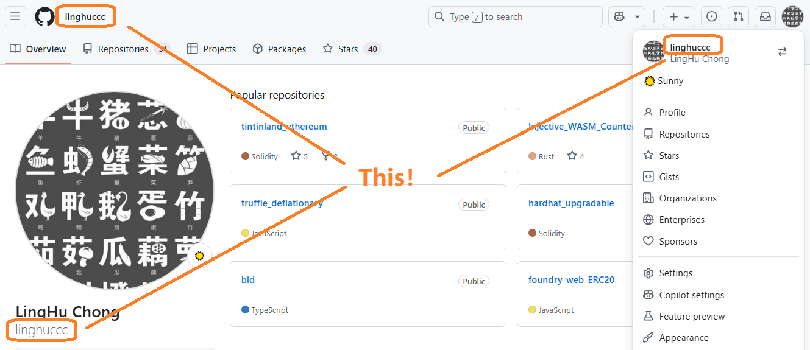

## 提交作业规则

-   **提交第一天作业**：

    -   Step1: 直接 Fork 这个仓库。
    -   Step2: 复制 00-GithubID-ClickCounter.sol 并且重命名为 YourStudentID-YourGithubID-ClickCounter.sol（如 08-linghuccc-ClickCounter.sol ），并按照课程要求修改内容。
    -   Step3: 创建一个 PR 到当前仓库，本课程助教会对你的 PR 进行 review，review 通过后，你的 PR 会被 merge 到 main 分支。

-   **提交后续作业**：

    -   第一天作业提交成功后，你会收到邀请加入这个仓库 contribution 的邮件（请记得接受邀请），接受邀请后你将获得 main 分支的 push 权限。
    -   从第二天作业开始，你需要将每天作业按要求更新到该日的 Assignments 文件夹中。
    -   **⚠️⚠️⚠️ 只可以修改你自己的文件，请不要修改其他人的文件**

## 我的 Github ID 是什么？

